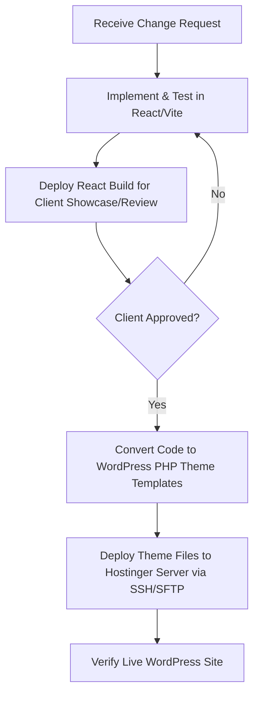

# Custom WordPress Theme Migration (Gutenberg + ACF)

This plan outlines the steps to migrate the React/Vite/TypeScript frontend of **TechNova Systems** into a custom, highly-performant WordPress theme. This will allow the client to edit all text, images, and videos easily from the WordPress dashboard, while keeping the exact same layout, responsiveness, and hover/scroll animations 100% intact.

---

## Server & WordPress Details (Verified)

> [!TIP]
> **Hostinger SSH Status**: Connected & Verified (Successful Connection on Port 65002)
> **Site Link**: https://technova.sachindesign.com/

### WordPress Credentials
* **ID / Email**: `sm621331@gmail.com`
* **Password**: `[Saved Securely in Local Artifact]`

### Hostinger SSH Details
* **IP Address**: `145.79.209.183`
* **Port**: `65002`
* **Username**: `u829703776`
* **SSH Password**: `[Saved Securely in Local Artifact]`

---

## Technical Approach for 100% Animation Fidelity

To ensure the custom hover animations (like the letter-wave effect) and scrolling effects are not lost, we will implement the following:

1. **Vanilla JS Wave Generator**:
   In React, we used the `<WaveLetters>` component to programmatically split headings into individual `` letters with animation delays. In WordPress, we will write a tiny helper script (wave-effects.js) that automatically reads any text wrapped in a `.wave-heading` class, splits the letters, and applies the animation delays. This means the client can type plain text in WordPress (e.g., `"Build Your Next Team"`), and the wave animation will automatically generate on the frontend.
2. **Tailwind compilation**:
   We will bundle the current Tailwind CSS rules along with the custom keyframes from `index.css` into the WordPress theme's main `style.css` stylesheet.

---

## Proposed Changes

We will create a new custom WordPress theme named `technova-theme` in the `/wp-content/themes/` directory:

### [technova-theme]

#### [NEW] [style.css](file:///wp-content/themes/technova-theme/style.css)
* The main stylesheet containing compiled Tailwind classes, global typography, and keyframe animations (`@keyframes letter-wave`, `.wave-heading`, `.liquid-glass-dark`, etc.).

#### [NEW] [functions.php](file:///wp-content/themes/technova-theme/functions.php)
* Enqueues theme stylesheets and scripts.
* Configures WordPress support (custom logo, menus, post thumbnails).
* Defines ACF Fields programmatically or exports them via JSON (so they load automatically in the editor).

#### [NEW] [header.php](file:///wp-content/themes/technova-theme/header.php)
* Handles `<head>` tags, meta viewports, Google Fonts integrations, and the navigation bar (desktop mega-menu and mobile drawer) with editable solution links.

#### [NEW] [footer.php](file:///wp-content/themes/technova-theme/footer.php)
* Implements the footer layout including social icons (with the new X logo), copyright information, newsletter subscription forms, and enqueues scripts.

#### [NEW] [front-page.php](file:///wp-content/themes/technova-theme/front-page.php)
* The main page template that fetches the custom fields from ACF (e.g., `get_field('hero_heading')`, `get_field('capabilities_list')`) and outputs the pixel-perfect HTML structure.

#### [NEW] [wave-effects.js](file:///wp-content/themes/technova-theme/assets/js/wave-effects.js)
* Small script to handle the marquee velocity, counting animations, scroll reveals, and automatically splitting header text into animating span elements.

---

## Development & Deployment Workflow

To ensure maximum safety, smooth client reviews, and pixel-perfect handover, we adhere to the following workflow:

1. **Phase 1 (React/Vite First)**: All UI, text adjustments, layouts, and animations are coded and verified in the React/Vite codebase. The React/Vite code remains the source of truth for the frontend styling and UI logic.
2. **Phase 2 (Client Showcasing)**: The built static site is showcased to the client. Any tweaks or iterations requested by the client are made and approved within this React container.
3. **Phase 3 (WordPress Compilation)**: Once the changes are fully approved, we port the new components, HTML markup, and compiled CSS variables into our custom `/wordpress-theme/` folder and upload them to the Hostinger WordPress server.

---

## Verification Plan

### Manual Verification
1. **WP Admin Dashboard Test**: Log into the WordPress dashboard and ensure the editing fields for Hero text, Capabilities, and CTA buttons exist and save content properly.
2. **Animation check**: Test page hover states and make sure the letter-wave animation triggers correctly on all headings.
3. **Responsiveness test**: Inspect the layout on Mobile, Tablet, and Desktop screens to verify it remains 100% pixel-perfect.
4. **Performance check**: Test page load speed on Google PageSpeed Insights after deploying to the Hostinger hosting.
